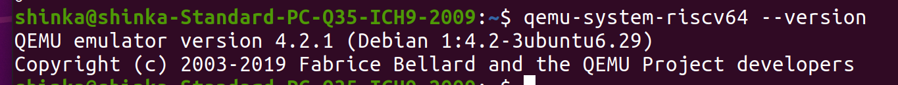
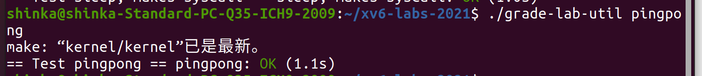
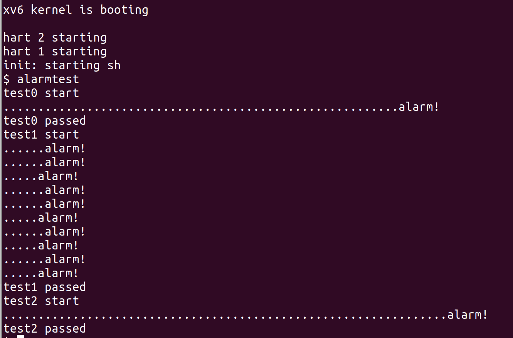

# xv6实验报告

---

## 环境搭建

1. 使用gnome-boxes安装Ubuntu20.04 LTS

2. 运行```sudo apt-get install git build-essential gdb-multiarch qemu-system-misc gcc-riscv64-linux-gnu binutils-riscv64-linux-gnu```安装需要的包

3. 运行```qemu-system-riscv64 --version```和```riscv64-linux-gnu-gcc --version```检测环境是否安装成功

---

## Lab 1: Xv6 and Unix utilities

### Boot xv6

#### 实验目的

在qemu虚拟机中运行xv6环境

#### 实验步骤

1. 从远程仓库中检出util分支
   
   ```shell
   $ git clone git://g.csail.mit.edu/xv6-labs-2021
   Cloning into 'xv6-labs-2021'...
   ...
   $ cd xv6-labs-2021
   $ git checkout util
   Branch 'util' set up to track remote branch 'util' from 'origin'.
   Switched to a new branch 'util'
   ```

2. 试运行```make qemu```
   
   

3. 测试```ls```命令
   
   

#### 实验中遇到的问题和解决方法

一开始尝试在arch（本机）上直接运行，但是2021年的课程文件在如今（2024）已经过时了，在滚动更新的arch中无法运行，因此选择在Ubuntu虚拟机运行

#### 实验心得

学习了xv6的启动和gcc的基本调试方法

### sleep

#### 实验目的

1. 在xv6操作系统上实现sleep

2. 熟悉调用系统内核的方法

3. 熟悉在xv6上进行c语言编程与调试

#### 实验步骤

1. 引用头文件
   
   - "kernel/types.h"
     
     基本类型的定义
   
   - "kernel/stat.h"
     
     文件系统结构的定义
   
   - "user/user.h"
     
     用户调用系统内核的接口

2. main函数
   
   ```c
   int main(int argc, char *argv[])
   {
     if (argc < 2)
     {
       fprintf(2, "need a param");
       exit(1);
     }
     int i = atoi(argv[1]);
     sleep(i);
     exit(0);
   }
   ```
   
   argc是传入参数的数量，argv是具体参数。参数至少有1个，第0号参数指向程序自身。
   
   sleep函数是用户调用系统sleep的接口。
   
   用过autoi将参数转为int型

3. 测试

#### 实验中遇到的问题和解决方法

在未阅读内核源码时，无法得知sleep的调用接口，需要我们熟悉系统各种接口的使用方法。

#### 实验心得

1. 本实验初步揭示了Unix-like系统的内核结构。用户不是直接访问内核，而是通过调用系统提供的接口来对内核进行访问。

2. 本实验也说明了在c语言中系统向程序传递参数的方式

### pingpong

#### 实验目的

1. 学习在Unix-like系统下创建子进程的方式

2. 学习父进程与子进程通过管道通信的方式

3. 学习基本的进程同步操作

#### 实验步骤

1. 使用`pipe()`函数创建管道
   
   ```c
   int parent_fd[2];
   pipe(parent_fd);
   ```
   
   `pipe(p)` 函数会在 `int *p` 指针指向的地址处生成两个文件描述符。`p[0]` 是读端的文件描述符，`p[1]` 是写端的文件描述符。持有这些文件描述符的进程可以对管道进行读写操作。

2. 使用`fork()`创建子进程
   
   ```c
     if (fork() == 0)
     {
       ...
     }
     else if(fork()>0)
     {
       ...
     }
   ```
   
   当 `fork()` 被执行时，系统会自动生成一个子进程。在父进程中，`fork()` 的返回值是子进程的 ID，通常大于 0；在子进程中，`fork()` 的返回值为 0；如果进程创建失败，`fork()` 将返回 -1。

3. 使用`wait()`实现进程同步
   
   对于父进程而言，`wait(&status)` 函数会阻塞父进程直到某一个子进程退出，并返回该子进程的 ID。如果没有子进程在运行，`wait` 函数将返回 -1 并设置 `errno`。`status` 将包含子进程的退出状态。

4. 核心代码
   
   ```c
   if (fork() == 0) //子进程
    {
    char buf[10];
    read(parent_fd[0], buf, sizeof buf);
    int id = getpid();
    printf("%d: received %s\n", id, buf);
    write(child_fd[1], "pong", 4);
    close(child_fd[0]);
    close(child_fd[1]);
    }
    else //父进程
    {
    char buf[10];
    int id = getpid();
    write(parent_fd[1], "ping", 4);  
    close(parent_fd[1]);//及时关闭写端文件描述符
    int status;
    wait(&status); //进程同步，等待子进程结束
    read(child_fd[0], buf, sizeof buf);
    printf("%d: received %s\n", id, buf);
    close(child_fd[0]);
    }
   ```

5. 测试结果

#### 实验中遇到的问题和解决方法

1. 在一开始对创建进程与管道没有任何概念，通过阅读教科书学习了创建子进程以及管道的使用方法。

2. 实验过程中忽视了对写端文件描述符的关闭，导致读进程被阻塞。在实践中及时关闭管道的文件描述符很重要。

3. 实验过程中忽视了进程之间的同步。通过wait()函数，可以使进程之间的通信在恰当的时候进行。

#### 实验心得

1. 父子进程的概念是一个难点，每fork一次都会新建一个子进程，而通过fork的返回值可以判断当前处在父进程还是子进程，从而在不同分支中执行不同的语句。

2. 管道的理解是另一个难点。创建一个管道类似于创建了一个临时文件，创建它的进程拥有指向它的文件描述符。当子进程被创建时，文件描述符也会被复制，即指向管道的文件描述符多了一份。在写端的文件描述符没有完全关闭时，读操作将被阻塞。当指向管道的所有文件描述符都被关闭时，管道被释放。为了使管道正常被释放，所有进程都需要正确地关闭文件描述符。

3. 使用wait可以实现基本进程同步。

### primes

#### 实验目的

1. 进一步掌握子进程的创建与进程间的通信

2. 实现基本的并发操作

#### 实验步骤

1. 埃拉托色尼筛法
   
   要找出2到n(n≥2)的所有质数：
   
   - 从第一个数2开始，在剩余的数中去除它的所有倍数
   
   - 从小到大检查列表里的每一个数，每检查到一个数时就去除它的所有倍数
   
   - 所有被检查到的数都是质数

2. 并发执行过程
   
   - 父进程初始化2到35的升序序列，写入管道，将序列传给第一个子进程。
   
   - 子进程通过管道从它的父进程读取序列，并且将序列中的第一个数标记为质数，同时创建它的管道与子进程。
   
   - 子进程在剩余序列中去除第一个数（检查的某个质数）的倍数，将得到的结果写入管道，传给它的子进程。
   
   - 所有的进程像一条链条一样串联起来，形成一颗进程树（链），链条的每个环境都能检出一个质数

3. 核心代码
   
   ```c
     pipe(fd1);
     if (fork() > 0)
     {
       close(fd1[0]);
       for (int i = 2; i <= 35; i++)
       {
         write(fd1[1], &i, sizeof(i));
       }
       close(fd1[1]);
       int status;
       wait(&status); // 等待子进程结束
     }
     else
     {
       p1 = fd1;
       p2 = fd2;
       while (1)
   //子进程在交换了管道文件描述符后回到这里，执行一轮循环。
   //此时它将创建它的子进程，成为一个父进程
       {
         pipe(p2); 
         close(p1[1]);
         if (read(p1[0], &first, sizeof(first)))
           printf("prime %d\n", first);
         else
           break;
         if (fork() > 0)
       //父子进程在这里分界，子进程获得父进程在此之前的数据的拷贝
         {
           while (read(p1[0], &v, sizeof(v)))
           {
             if (v % first != 0)
               write(p2[1], &v, sizeof(v));
           }
           close(p1[0]);
           close(p2[1]);
           int status;
           wait(&status); // 等待子进程结束
           break;
         }
         else
         {
           close(p1[0]);
           int *tmp = p1;//交换新旧管道文件描述符
           p1 = p2;
           p2 = tmp;
         }
       }
     }
   ```

4. 测试结果
   
   

#### 实验中遇到的问题和解决方法

1. 这个实验相比pingpong难度有了较大的提高，不仅需要实现多进程的并发，而且要在不同进程间进行通信，要完成该实验需要对fork与pipe有较为深入的理解。我对它们的理解见pingpong实验。

2. 在实验中，为了防止某一子进程变成孤儿进程，需要确保子进程退出后才能退出父进程，通过wait实现

3. 在实验中，需要及时关闭管道文件描述符，以保证管道被正常释放，以免占用过多空间。

#### 实验心得

通过该实验，我初步掌握了并发编程，同时对进程之间的通信与同步机制也有了更深的理解。详见pingpong实验。

### find

#### 实验目的

1. 熟悉Unix-like系统的文件系统组织结构

2. 熟悉对文件系统的读取和查找

#### 实验步骤

1. `stat`结构
   
   `stat`中存储了文件的元数据，不管是文件还是文件夹都是如此，通过`stat.type`判断文件类型。

2. `dirent`结构
   
   `dirent`是文件夹拥有的目录结构。如果文件的类型是文件夹，`dirent`会记录该文件夹的目录

3. 核心代码
   
   ```c
   void find(const char *path, const char *name)
   {
       ...
       if ((fd = open(path, 0)) < 0)//打开文件
         ...
       if (fstat(fd, &st) < 0)
         ...//读取stat
       if (st.type == T_FILE)//如果是文件进行匹配
         ...//匹配操作
       if (st.type == T_DIR)//如果是文件夹，检查目录
       {
           ...//检查路径长度
           strcpy(buf, path);
           p = buf + strlen(buf);
           *p++ = '/';
           while (read(fd, &de, sizeof(de)) == sizeof(de))
           {
               if (de.inum == 0 || strcmp(de.name, ".") == 0 || strcmp(de.name, "..") == 0)
                   continue;
       //inum为0表示文件不存在或为空，'.'表示当前目录，'..'表示父目录
               memmove(p, de.name, DIRSIZ);
               p[DIRSIZ] = 0;
               find(buf, name);//递归查询下一层目录
           }
       }
       close(fd);
   }
   ```

4. 测试结果
   
   

#### 实验中遇到的问题和解决方法

1. 没有找到C标准库中的`strrchr`函数，需要自己实现路径匹配中查找`/`的操作
2. 一次查询操作只能在当前目录下进行匹配，匹配不完全，需要进行递归操作

#### 实验心得

通过本实验，我初步掌握了Unix-like系统的文件系统结构，学习了对文件夹的目录读取和递归遍历。在该文件系统下，文件与文件夹用同一个结构存储，而目录则单独使用一个结构来存储。

### xargs

#### 实验目的

1. 了解Unix-like系统下xargs命令的使用方法

2. 学习在一个程序下进入另一个程序的方法

3. 进一步学习并发执行，使不同的进程执行不同的子程序

#### 实验步骤

1. 核心代码
   
   ```c
   int main(int argc, char *argv[])
   {
       ...
       for (int i = 1; i < argc; i++)// 把argv的内容拷贝到new_argv
           new_argv[i - 1] = argv[i];
       while (gets(buf, sizeof(buf)))// 循环读取用户的输入
       {
           ... //拆分参数
           if (fork() == 0)// 创建子进程并执行新程序
           {
               exec(new_argv[0], new_argv);
               exit(0);  
           }//父进程进入下一次循环，与子进程同时进行，实现并发
       }
       while (wait(0) > 0);//父进程等待所有子进程退出后再退出
       exit(0);
   }
   ```

2. 测试结果

#### 实验中遇到的问题和解决方法

实验中，对xargs命令不熟悉，不了解它的作用与运行机制。通过学习linux的xargs命令后对它有了基本的理解

#### 实验心得

1. 了解了xargs的使用方法与作用，对Unix-like系统的使用有了更深的理解

2. 学习了多进程的进阶使用方法，子进程不一定要与父进程执行同一个程序，子进程也可以是另一个程序的入口。通过这种方法，不仅可以极大提高并发执行效率，而且子进程之间彼此互不干涉，只要父进程不崩溃，子进程的故障不会影响全局。

---

## Lab 2: system calls

### System call tracing

#### 实验目的

1. 学习用户调用系统内核的过程

2. 学习追踪系统内核的调用

3. 学习Unix-like系统中trace的用法

#### 实验过程

1. 在 Makefile 的 `UPROGS` 中添加 `$U/_trace`

2. 在 `user/user.h`中添加 trace 系统调用原型
   
   ```c
   int trace(int);
   ```

3. 在 `user/usys.pl` 脚本中添加 trace 对应的 entry
   
   ```c
   entry("trace");
   ```

4. 在 `kernel/syscall.h` 中添加 trace 的系统调用号
   
   ```c
   #define SYS_trace 22
   ```

5. 实现trace的系统调用函数
   
   在`kernel/syscall.h`中为结构体proc添加成员`int tracemask`，在`kernel/sysproc.c`中实现trace系统函数
   
   ```c
   uint64
   sys_trace(void) {
       int mask;
       if (argint(0, &mask) < 0)
           return -1;
       myproc()->tracemask = mask;
       return 0;
   }
   ```

6. 修改 `fork()` 函数，将父进程的跟踪掩码复制到子进程。
   
   ```c
   np->tracemask = p->tracemask;
   ```

7. 修改`kernel/syscall.c`文件。
   
   - 添加 `sys_trace()` 的外部声明
     
     ```c
     extern uint64 sys_trace(void);
     ```
   
   - 添加 `syscalls` 函数指针的对应关系
     
     ```c
     static uint64 (*syscalls[])(void) = {    
       ...    
       [SYS_trace] sys_trace,
     };
     ```
   
   - 新建`syscalls_name`数组来映射系统调用名
     
     ```c
     static const char *syscalls_name[] = 
     {
       [SYS_fork]    "fork",
       [SYS_exit]    "exit",
       ...
     }
     ```
   
   - 修改`syscall()`以跟踪输出
     
     ```c
         if ((1 << num) & p->tracemask)  //lab 2.1
           printf("%d: syscall %s -> %d\n", p->pid, syscalls_name[num],p->trapframe->a0);
     ```

8. 测试结果
   
   

#### 实验中遇到的问题和解决方法

- 在实验中遇到了make不通过的情况
  
  后来发现在makefile中`\`是续行符，其末尾不能有空格或制表符

- 实验中对Unix-like系统的内核调用机制不了解，在阅读了资料以后才明白trace的过程

#### 实验心得

完整的内核调用过程如下

1. 在`user/user.h`中是系统调用的接口，用户对内核的访问必须通过其中的接口

2. 接口函数由perl脚本文件`usys.pl`实现，它会自动生成`usys.S`文件
   
   ```perl
   sub entry {
       my $name = shift;
       print ".global $name\n";
       print "${name}:\n";
       print " li a7, SYS_${name}\n";
       print " ecall\n";
       print " ret\n";
   }
   ```
   
   在entry中将系统调用号写入a7寄存器，执行ecall指令，系统由用户态陷入内核态

3. `usertrap`进入内核态：
   
   `ecall` 指令会触发一次用户态的陷阱（trap），从而切换到内核态。陷阱处理从 `uservec` 开始。`uservec` 会保存一些用户态的寄存器值并跳转到 `usertrap`。

4. `usertrap`处理trap：
   
   `usertrap` 检查陷阱的原因。如果是系统调用，则会处理该系统调用。在处理系统调用之前，内核会保存用户态的上下文，以便在返回用户态时恢复。`usertrap` 调用 `syscall` 函数来处理系统调用。

5. `syscall`内核调用：
   
   `syscall` 从陷阱帧中读取系统调用号和参数。根据系统调用号，`syscall` 调用相应的系统调用处理函数。例如，`sys_trace`。系统调用处理函数执行相应的操作，然后将结果返回给 `syscall`。

6. `usertrapret`恢复用户上下文：
   
   系统调用处理完毕后，`usertrap` 会检查是否有必要终止进程或切换进程。如果需要返回用户态，`usertrap` 调用 `usertrapret`。`usertrapret`准备恢复用户态的上下文，并最终跳转到`userret`。

7. `userret`回到用户态：
   
   `userret` 从陷阱帧中恢复用户态的寄存器值。最后，`userret` 使用 `sret` 指令返回到用户态。

在内核调用的过程中，用户无法直接向内核传递参数，而是写入用户寄存器中，系统函数通过特定函数读取用户空间的寄存器

### Sysinfo

#### 实验目的

1. 学习查看与调用系统信息

2. 学习初步的内存访问操作

3. 学习读取系统的进程数

#### 实验过程

1. 添加系统调用（与trace实验相同）
   
   - 在 Makefile 的 `UPROGS` 中添加 `$U/_trace`
   
   - 添加`user/user.h`中的系统调用原型
   
   - 添加entry
   
   - 分配系统调用号

2. 实现辅助函数
   
   - 在 `kernel/kalloc.c` 中查看内存用量
     
     ```c
     uint64 
     getfreemem(void) {
         uint64 n;
         struct run *r;// freelist中维护空闲页表数
         for (n = 0, r = kmem.freelist; r; r = r->next)
             ++n;
         return n * PGSIZE;//空闲页表数*页表大小即空闲内存大小
     }
     ```
   
   - 在 `kernel/proc.c` 中查看进程数
     
     ```c
     uint64 
     getnproc(void)
     {
       for (num = 0, np = proc; np < &proc[NPROC]; ++np)
         if (np->state != UNUSED)
           ++num;  //进程数计数
       return num;
     }
     ```
   
   - 在 `kernel/defs.h` 中添加对应的函数原型

3. 实现系统调用
   
   ```c
   uint64
   sys_sysinfo(void)
   {
     ...
     info.freemem = getfreemem();
     info.nproc = getnproc();
     if(copyout(myproc()->pagetable, addr, (char *)&info, sizeof(info)) < 0)
       return -1;
     return 0;
   }
   ```

4. 测试结果
   
   

#### 实验中遇到的问题和解决方法

- 在本实验中，我们仍然和上一个实验一样需要新建系统调用，需要在多个文件中进行修改，如果不熟悉系统调用的过程中可能会出现许多编译错误。通过阅读编译错误返回的信息，最终成功实现了实验的要求

- 在本实验中，我们需要对系统的内存与进程的结构进行一定的了解，并学习对他们的访问和计算。

#### 实验心得

通过本次实验，我初步了解了xv6系统中对系统信息的读取。尤其是对内存页表的访问和计算，这为之后对内存部分的学习打下了初步的基础。

---

## Lab 3: Page tables

### Speed up system calls

#### 实验目的

1. 学习在内核与用户之间创建共享只读内存

2. 学习优化加速系统调用

3. 初步学习内存的分配、初始化、映射和释放

#### 实验过程

1. 在`kernel/proc.h`中的`proc`结构体中增加共享页面的指针定义
   
   ```c
   struct usyscall *usyscallpage;
   ```

2. 在`kernel/proc.c`的`allocproc`实现共享内存的分配与初始化
   
   ```c
   if ((p->usyscallpage = (struct usyscall *)kalloc()) == 0) {
     freeproc(p);
     release(&p->lock);
     return 0;
   }//页面分配，如果失败则释放并返回0
   p->usyscallpage->pid = p->pid;//将系统调用得到的pid存在共享页中
   ```

3. 在`kernel/proc.c`的`proc_pagetable`，将内存映射到用户空间，设置为只读模式
   
   ```c
   if(mappages(pagetable, USYSCALL, PGSIZE, (uint64)(p->usyscallpage), PTE_R | PTE_U) < 0) {
     uvmfree(pagetable, 0);
     return 0;
   }
   ```

4. 在`kernel/proc.c`的`proc_freepagetable`中取消这一映射
   
   ```c
   uvmunmap(pagetable, USYSCALL, 1, 0);
   ```

5. 在`kernel/proc.c`的`freeproc`中增加释放共享页面的处理
   
   ```c
   if(p->usyscallpage)
     kfree((void *)p->usyscallpage);
   p->usyscallpage = 0;
   ```

6. 测试结果

#### 实验中遇到的问题和解决方法

1. 在实验时，在内存分配以后没有将pid正确写入页面中，导致返回值与正常的pid不匹配，经过测试以后修复了这一错误

2. 在实验的过程中，对Unix-like系统中内存的管理不熟悉，通过阅读相关资料理解了这一过程

#### 实验心得

1. 在xv6中，每次系统调用都会触发中断，陷入内核态，对于一些会重复进行的简单系统调用中，这一过程会增加许多系统开销。以本实验的getpid为例，在进程被创建的时候，创建了一个用户只读页面，并向其中写入pid。用户在getpid时只需读取这一页面即可获取到pid，而无须中断系统。

2. 通过本实验，我学会的对Unix-like系统中内存页的“分配-映射-取消映射-释放”过程，学习了基本的内存页管理

3. 通过本实验，我学习了优化与加速系统调用的基本方法，对系统底层的管理与加速有了更深入的理解。

### Print a page table

#### 实验目的

进一步理解xv6中页表的组织结构

#### 实验过程

1. 在 `kernel/defs.h` 中声明`vmprint` 

2. 在 `kernel/vm.c` 中实现函数 `vmprint`，对页表进行递归访问并打印页表。

3. 在 `exec.c` 的 `exec()` 函数中添加`vmprint`的入口

4. 测试结果
   
   

#### 实验中遇到的问题和解决方法

对页表结构的理解不够深入，在递归打印的设计上有困难。在参考了`freewalk`函数的设计之后完成实验。

#### 实验心得

通过本实验，我对xv6系统的页表结构有了更进一步的认识。

1. **第0页包含什么？** 第 0 页包含指向其他页表页的指针，以构建页表的层次结构。

2. **第2页包含什么？** 第 2 页中的 PTE 包含指向下一级页表页（第 2 级页表页）的物理地址。

3. **以用户模式运行时，进程能否读/写第 1 页映射的内存？** 该条目的值是 `0x21fda00f`，包含标志位。根据标志位（假设用的是类似于 x86 的页表结构），`0x0F` 代表只读权限（PTE_R | PTE_V | PTE_U）。因此，用户模式下的进程可以读取但不能写入该页。

4. **倒数第三页包含什么？** 在 xv6 中，倒数第三页是指向用户栈的 PTE，它的权限通常是可读、可写和用户权限。用户栈用于存储进程在用户模式下调用函数时的局部变量和临时数据。

### Detecting which pages have been accessed

#### 实验目的

1. 进一步学习xv6的页表结构

2. 实现系统调用以检测被使用的页表

#### 实验过程

1. 定义PTE_A
   
   在xv6中，PTE结构如下
   
   其中，PTE_A意为“访问位”(Accessed Bit)，每当一个内存页面被访问时，PTE_A都会被自动置为1.由图中可知，PTE_A在第六位。
   
   在`kernel/riscv.h` 中添加`#define PTE_A (1L << 6)`。

2. 在 `kernel/sysproc.c` 中实现 `sys_pgaccess()`
   
   - 使用`walk`函数遍历对应的页表项
   
   - 检查对应表项的PTE_A，存储到临时变量。
   
   - 将检查过的PTE_A清零
   
   - 将临时变量拷贝到用户空间

3. 测试结果

#### 实验中遇到的问题和解决方法

实验中调用了`walk`函数，但由于没有显式声明，编译器在编译过程中产生错误。


添加声明语句`pte_t* walk(pagetable_t pagetable, uint64 va, int alloc);`后消除错误

#### 实验心得

通过这个实验，我对xv6的内存管理机制有了更进一步的了解。在实现系统调用过程中，我深入了解了内核代码的组织结构和运行方式，以及如何将用户态的请求转换为内核态的操作，并了解了如何从用户空间传递参数到内核空间。

---

## Lab 4: Traps

### RISC-V assembly

#### 实验目的

学习RISC-V汇编

#### 实验过程

1. **函数参数存在哪些寄存器中？例如，在 `main` 中调用 `printf` 时，哪个寄存器保存了值 `13`？**
   
   在 RISC-V 架构中，函数的参数通常存储在 `a0` 到 `a7` 这几个寄存器中。在 `main` 中调用 `printf` 时，值 `13` 被存储在 `a2` 寄存器中（对应汇编指令 `4635 li a2,13`）。

2. **在 `main` 的汇编代码中，调用函数 `f` 的指令在哪里？调用 `g` 的指令在哪里？（提示：编译器可能会内联函数。）**
   
   在 `main` 的汇编代码中并没有显式调用 `f` 函数的指令。这是因为编译器内联了 `f` 函数，将 `f` 函数的实现直接嵌入到 `main` 中。由于 `f` 函数只是调用 `g` 函数并返回其结果，而 `g` 函数也被内联了，因此直接在 `main` 中得到对 `g` 函数操作的结果。
   
   汇编指令 `250d addiw a0,a0,3` 实际上就是 `f(8)` 和 `g(8)` 被内联后的代码。

3. **`printf` 函数位于什么地址？**
   
   在 `main` 的汇编代码中，`printf` 函数的地址通过以下指令计算得到：
   
   ```scss
   00000097 auipc ra,0x0
   600080e7 jalr 1536(ra)
   ```
   
   根据这两条指令，`printf` 函数位于相对于当前指令地址偏移1536个字节的位置。
   
   查阅手册可知，其实际地址在 `0x630`。

4. **在 `main` 中调用 `printf` 后，寄存器 `ra` 中的值是什么？**
   
   在 `jalr` 指令执行后，`ra` 寄存器中会保存调用 `printf` 函数后返回时的地址。也就是说，它保存的是 `printf` 函数返回后，`main` 函数下一条需要执行的指令的地址。

5. **运行以下代码，输出是什么？**
   
   ```c
       unsigned int i = 0x00646c72;
       printf("H%x Wo%s", 57616, &i);
   ```
   
   **如果 RISC-V 是大端序，那么要获得相同的输出，应该将 `i` 设置为多少？需要更改 `57616` 的值吗？**
   
   - 输出：`He110 World`
     
     `57616` 的十六进制表示为 `e110`，因此 `H%x` 被替换为 `He110`。
     
     `i` 的值为 `0x00646c72`，在小端序下，它表示字符串 `"rld"`，所以 `Wo%s` 被替换为 `"World"`。
   
   - 如果 RISC-V 是大端序，那么需要将 `i` 设置为 `0x726c64`。这在大端序下表示 `"rld"`，可以得到相同的输出。对于 `57616`，不需要更改，因为它的表示和处理与字节顺序无关。

6. **在以下代码中，`y=` 后面会打印什么？为什么会发生这种情况？**
   
   ```c
   printf("x=%d y=%d", 3);
   ```
   
   输出:`x=3 y=<未定义值>`
   
   `printf` 期望两个整数参数，但实际上只传递了一个值 `3`。因为 `y=%d` 处的第二个参数缺失，所以 `printf` 会从栈中读取未定义的值，这个值可能是随机的或意外的，因此 `y=` 后面的值是未定义的垃圾值。

#### 实验中遇到的问题和解决方法

- 实验之前我对汇编的了解不多，在实验时参考手册对RISC-V汇编进行了进一步的学习和了解

- 一开始不了解内联函数，不理解调用的入口在哪。经过学习以后理解了内联函数的逻辑

#### 实验心得

对汇编有了进一步的理解

### Backtrace

#### 实验目的

实现一个回溯功能，查看发生错误时栈中的函数调用顺序

#### 实验过程

1. 在 `kernel/riscv.h` 中添加 `r_fp()` 函数，获取帧指针

2. 在 `kernel/printf.c` 中实现 `backtrace()` 函数，使用帧指针遍历栈帧，并打印每个栈帧中保存的返回地址。并在`kernel/defs.h` 中声明

3. 在 `sys_sleep` 中调用 `backtrace()`

4. 运行bttest测试
   
   

5. 使用 `addr2line` 工具将这些地址转换为函数名和文件行号，以确定错误发生的位置
   
   

6. `backtrace` 函数添加到 `panic` 函数中，可在内核恐慌时查看错误

#### 实验中遇到的问题和解决方法

- **帧指针的使用**：
  在实验中，我需要理解帧指针在调用堆栈中的作用，以及如何利用它来访问上一级函数的返回地址。编译器会在每个栈帧中存放一个帧指针，该指针保存了调用者栈帧的地址。通过反向追踪这些帧指针，我可以在栈中向上遍历，并打印每个栈帧中保存的返回地址。
  
  为了正确输出这些地址，我还需要理解返回地址和栈帧指针之间的位置关系。经过学习，我了解到返回地址相对于栈帧指针有固定的偏移（-8），而保存的帧指针与当前帧指针之间的偏移为（-16）。

- **循环终止条件**：
  在编写 `backtrace` 函数时，我需要遍历整个调用栈，但最初不确定循环应该在什么条件下终止。通过学习，我发现可以使用 `PGROUNDDOWN` 和 `PGROUNDUP` 宏来计算栈页的顶部和底部地址，从而确定循环终止的条件。

#### 实验心得

在完成这个实验的过程中，我深入理解了调用栈和帧指针的关键概念。通过实现 `backtrace` 函数，我对程序执行过程中函数的调用和返回机制有了更深的认识。

我认识到帧指针在调用栈中的重要作用。帧指针是保存调用者栈帧指针的位置，它帮助我们在调用链中向上遍历。通过正确使用帧指针，我能够遍历每个栈帧并访问其中保存的返回地址，从而成功实现了回溯功能。

理解返回地址与帧指针的相对位置非常关键。根据 RISC-V 的调用约定，返回地址相对于帧指针有固定的偏移。通过参考课堂笔记，我能够准确计算并访问这些地址，确保输出的正确性。

解决循环终止条件的问题是实验中的一个难点。使用 `PGROUNDDOWN` 和 `PGROUNDUP` 宏帮助我确定栈页的边界，进而决定循环何时终止。这个问题的解决使我更加自信地遍历调用栈。

### Alarm

#### 实验目的

#### 实验过程

1. 添加系统调用`sys_sigalarm` 和 `sys_sigreturn`的入口，分配系统调用号

2. `sys_sigalarm` 
   
   这个函数的作用是恢复进程的状态，使进程能够继续执行在被信号处理程序中断之前的代码。
   
   - **获取当前进程的结构体指针**：调用 `myproc()` 获取当前进程的 `proc` 结构体指针，这个结构体包含了与进程相关的所有信息。
   
   - **恢复进程的 trapframe**：通过 `*proc->trapframe = proc->saved_trapframe;` 将保存在 `saved_trapframe` 中的寄存器状态恢复到 `trapframe` 中。`trapframe` 是一个保存了进程当前寄存器状态的结构体，通过恢复它，进程可以从中断点继续执行。
   
   - **标记返回状态**：设置 `proc->have_return = 1;`，表示已经成功恢复到中断前的状态。
   
   - **返回处理前的 a0 寄存器的值**：函数的返回值是 `proc->trapframe->a0`，这通常是被中断的系统调用的返回值。

3. 实现`sys_sigalarm(void)`
   
   这个函数的作用是设置进程的报警机制，使得进程在指定的时间间隔后执行指定的处理函数。
   
   - **获取参数**：通过 `argint(0, &ticks);` 和 `argaddr(1, &handler_va);` 获取传递给系统调用的参数。`ticks` 是报警的时间间隔，以 CPU 时间的滴答数为单位，`handler_va` 是用户定义的处理函数的虚拟地址。
   
   - **获取当前进程的结构体指针**：和 `sys_sigreturn` 一样，调用 `myproc()` 获取当前进程的 `proc` 结构体指针。
   
   - **设置报警间隔和处理函数地址**：将报警间隔 `ticks` 和处理函数地址 `handler_va` 分别存储在 `proc` 结构体的 `alarm_interval` 和 `handler_va` 字段中。
   
   - **标记返回状态**：和 `sys_sigreturn` 类似，设置 `proc->have_return = 1;`，表示已经成功设置了报警功能。
   
   - **返回值**：`sys_sigalarm` 返回 `0`，表示系统调用成功完成。

4. 修改`usertrap`函数，处理达到报警时触发中断的情况

5. 测试alarmtest
   
   

6. 测试usertests
   
   

#### 实验中遇到的问题和解决方法

- 在添加系统调用的时候，一开始没有对系统调用进行声明和调用号的分配。需要进一步理解系统调用的过程。

- 对用户态到内核态的切换的过程不明。通过阅读参考手册对trap的过程进一步学习

#### 实验心得

通过本次实验，我学习了定时中断的操作，同时，我对用户态到内核态的切换的过程有了更进一步的认识。

---

## Lab 5: Copy-on-Write Fork for xv6

### Implement copy-on write

#### 实验目的

1. 实现写时复制的fork函数

2. 学习内存优化的方法

#### 实验过程

1. 修改 `uvmcopy()` 函数：
   
   - **目标**：在 `fork()` 时，不再为子进程分配新的物理页面，而是让父进程和子进程共享相同的物理页面，并将页面表项 (PTE) 的写权限去掉 (清除 `PTE_W` 位)。
   
   - **实现**：打开 `kernel/vm.c` 文件。修改 `uvmcopy()` 函数，让它为父进程和子进程共享页面而不是复制。在共享页面时，确保 PTE 的写权限 (`PTE_W`) 被清除。

2. 处理页面错误：
   
   - **目标**：当子进程或父进程尝试写入共享页面时，处理页面错误，通过分配新页面和复制内容来实现写时复制 (Copy-on-Write)。
   
   - **实现**：在 `kernel/trap.c` 中的 `usertrap()` 函数中添加代码来处理页面错误。当发生页面错误时，检查 PTE 是否有 COW 标记 (可以使用 RSW bits)。如果是 COW 页面错误，分配一个新页面，复制原页面内容，并更新 PTE 以指向新页面，同时恢复写权限。

3. 管理引用计数：
   
   - **目标**：确保物理页面在不再被任何进程使用时，才会被释放。
   
   - **实现**：在 `kernel/kalloc.c` 中，添加一个全局数组来跟踪每个物理页面的引用计数。在 `fork()` 中，当页面被共享时，增加引用计数。当一个进程释放页面时，减少引用计数。如果引用计数降到零，才释放页面。

4. 修改 `copyout()` 函数：
   
   - **目标**：确保在将数据从内核空间复制到用户空间时，正确处理 COW 页面。
   
   - **实现**：在 `kernel/vm.c` 中找到 `copyout()` 函数。在 `copyout()` 中，当它遇到一个 COW 页面时，使用与页面错误相同的机制，分配新页面并进行复制。

5. 运行`cowtest`测试


6. 运行`usertests`测试


#### 实验中遇到的问题和解决方法

1. 在实现 `uvmcopy()` 函数时，父进程和子进程在不触发页面错误的情况下直接写入共享页面，导致数据不一致和不正确的行为。
   
   **解决方法**: 确保在 `uvmcopy()` 函数中为父子进程的所有共享页面正确设置 PTE，特别是清除 `PTE_W` 位，确保共享页面在初始状态下是只读的。这可以通过检查页面表项中的标志位来确认。

2. 在 `usertrap()` 中处理页面错误时，出现死循环。
   
   **解决方法**: 调试 `usertrap()` 中的页面错误处理逻辑，确保在分配新页面后，页表项正确更新，并将 `PTE_W` 设置为可写。此外，可以使用调试输出或断点调试，跟踪页面错误的处理流程，确保没有不正确的循环调用。

#### 实验心得

通过本次实验，我成功实现了写时复制的 `fork()`，优化了 xv6 中的内存使用效率。写时复制不仅减少了内存的浪费，也提高了系统的性能，尤其是在需要频繁 `fork()` 的场景中。通过本次实验，我加深了对操作系统中虚拟内存管理的理解，特别是页面表的操作与页面错误的处理机制。同时，在实现过程中，我学会了如何在内核中实现资源的引用计数管理，这对于确保资源的正确释放至关重要。

---

## Lab 6: Multi-threading

### Uthread: switching between threads

#### 实验目的

1. 理解xv6的多线程机制

2. 设计一个用户级多线程系统

#### 实验过程

1. **理解现有代码：** 仔细阅读已经提供的`uthread.c`和`uthread_switch.S`文件。理解代码中已经存在的线程测试和基本的用户级线程操作

2. 在`uthread.c`中实现线程的创建和调度

3. 在`user/uthread_switch.S`中实现线程的切换

4. **测试结果**
   
   

#### 实验中遇到的问题和解决方法

1. 在 `thread_switch()` 线程切换后线程崩溃或行为异常。
   
   **解决方法**:
   
   - 仔细检查 `thread_switch()` 实现，确保所有需要保存的callee-save寄存器都被正确保存到当前线程的 `struct thread` 中，并在切换到目标线程时正确恢复这些寄存器。
   - 使用GDB调试，单步执行 `thread_switch()` 代码，检查寄存器的保存和恢复是否按预期进行，尤其是检查返回地址（`ra`）和栈指针（`sp`）。

2. **描述**: 新创建的线程在第一次调度时无法正确启动
   
   **解决方法**:
   
   - 确保在 `thread_create()` 中正确设置新线程的栈，特别是确保栈顶保存了正确的返回地址和初始寄存器值，使得线程能够从指定函数开始执行。
   - 在GDB中设置断点，检查新线程的栈和寄存器初始化情况，确认线程的栈布局正确。

#### 实验心得

通过本次实验，我深入理解了用户级线程的原理及其上下文切换的实现。在实现过程中，我体会到了手动管理线程上下文的复杂性和挑战，特别是在系统级编程中，调试和排查问题的难度。实验不仅强化了我对线程、寄存器和栈管理的理解，也让我更加熟悉了GDB调试工具的使用。在未来的开发中，这些技能将非常有用，特别是在需要深入理解和优化系统级代码时。

### Using threads

#### 实验目的

学习使用锁进行简单的线程同步

#### 实验过程

1. 测试ph在单线程和多线程下的运行情况
   
   

2. 分析原有代码，在这段代码中，`put`操作会同时修改哈希表中的链表。当多个线程同时执行`put`时，可能会发生以下情况：
   
   - **线程A**和**线程B**同时计算出相同的哈希桶索引`i`。
   - **线程A**和**线程B**都试图在同一个哈希桶中插入不同的键。
   - **线程A**调用`insert()`，但在完成链表更新之前，**线程B**也调用了`insert()`。
   - 由于两个线程没有适当的同步机制，它们可能会导致哈希桶链表的结构损坏，或者插入的键未被正确记录。

3. 解决方案：初始化一个静态锁数组，在插入每个数之前先获取锁，插入完成后再释放锁，最后销毁锁。

4. 修改完成后重新测试，无miss
   
   

5. 运行测试脚本
   
   

#### 实验中遇到的问题和解决方法

1. **死锁：** 错误地使用锁可能会导致死锁，即所有线程都在等待锁，无法继续执行。确保在使用锁时遵循正确的获取和释放顺序，以避免死锁情况的发生。同时，在最后尽管已经释放了锁，但是创建了锁会占用一定的资源和内存，这影响了程序的性能，因此我又添加上了`pthread_mutex_destroy`来销毁锁，从而避免在程序中反复创建锁而没有销毁它们，导致最终耗尽系统的资源，使得其他程序或操作受到影响。
2. **性能问题：** 
   使用过多的锁可能会导致性能下降，因为锁可能会限制多线程并行执行的能力。我需要考虑如何在不影响正确性的前提下，尽量减少锁的使用，以提高多线程性能。在某些情况下，并发的
   put()s 
   在哈希表中读取或写入的内存没有重叠，因此不需要锁来相互保护。因此我可以通过为每个哈希桶添加独立的锁来改进代码，从而提升并行性和性能。这样做的关键是将锁的粒度缩小到最小的冲突范围，避免了不必要的锁竞争。

#### 实验心得

使用多线程时，要注意对共享区域的修改，要使用锁来进行同步。同时，过多的使用锁会导致性能下降。在设计程序时，需要考虑到两者的平衡。

### Barrier

#### 实验目的

进一步学习锁原语

#### 实验过程

1. 阅读barrier的源代码

2. 实现barrier函数
   
   - 在达到barrier后首先要获取一个锁，保证线程到barrier函数的同步。
   
   - 如果该线程不是本轮次最后一个线程，暂时释放锁，并休眠，等待唤醒
   
   - 如果是本轮次最后一个线程，那么重置计数，轮次+1，并唤醒所有休眠的线程

3. 运行测试

#### 实验过程中遇到的问题和解决方法

1. 对共享变量进行修改时，必须使用锁进行同步

2. 使用`pthread_cond_wait`时，锁会被暂时释放，被唤醒时重新获取

#### 实验心得

通过这一实验，我进一步学习了锁原语，学会了使用屏障进行更高级的线程同步机制。

---

## Lab 7: Networking

#### 实验目的

学习设计网卡驱动。

#### 实验过程

- 完成`e1000_transmit`函数
  
  `e1000_transmit` 负责将要发送的数据包写入到传输描述符环 (TX ring) 中，然后通知 E1000 发送这些数据包。
  
  步骤：
  
  1. **获取下一个可用的传输描述符索引：**
     
     - 从 `E1000_TDT` 寄存器读取当前的传输描述符队列指针。
  
  2. **检查描述符是否可用：**
     
     - 检查描述符的状态位 `E1000_TXD_STAT_DD`，以确定该描述符是否可用（即，之前的传输是否已完成）。
     - 如果描述符不可用，则返回错误 `-1`。
  
  3. **释放前一个 mbuf：**
     
     - 如果之前在此描述符中存储了一个 mbuf，则需要使用 `mbuffree` 释放它。
  
  4. **填充描述符：**
     
     - 设置描述符的 `addr` 字段指向要发送的数据包的内存地址。
     - 设置描述符的 `length` 字段为数据包的长度。
     - 设置描述符的 `cmd` 字段以指示要发送的数据包，并根据 E1000 文档设置必要的命令标志，如 `E1000_TXD_CMD_EOP`（指示数据包的结尾）和 `E1000_TXD_CMD_RS`（要求发送完成时写回状态位）。
  
  5. **更新队列指针：**
     
     - 更新 `E1000_TDT` 寄存器，指向下一个描述符索引位置（环状数组，索引需要取模 `TX_RING_SIZE`）。
  
  6. **返回成功：**
     
     - 如果数据包成功添加到传输描述符队列，返回 `0`。

- 完成`e1000_recv`函数
  
  `e1000_recv` 负责从接收描述符环 (RX ring) 中读取已接收的数据包，并将其传递给网络栈进行处理。
  
  步骤：
  
  1. **获取下一个要处理的接收描述符索引：**
     
     - 获取当前 `E1000_RDT` 寄存器的值，并加一取模 `RX_RING_SIZE` 得到下一个描述符的索引。
  
  2. **检查描述符是否包含新数据包：**
     
     - 检查描述符的状态位 `E1000_RXD_STAT_DD` 以确定是否有新数据包可用。
     - 如果没有新数据包可用，则退出函数。
  
  3. **更新 mbuf 的长度：**
     
     - 根据描述符中的 `length` 字段，更新 mbuf 的 `m->len` 字段。
  
  4. **将数据包传递给网络栈：**
     
     - 使用 `net_rx(mbuf)` 函数将新接收到的 mbuf 传递给网络栈处理。
  
  5. **分配新的 mbuf：**
     
     - 使用 `mbufalloc` 分配一个新的 mbuf 并替换之前的 mbuf，以便 E1000 在此描述符位置再次接收到数据包时有一个新的缓冲区可用。
  
  6. **清除描述符的状态位：**
     
     - 将描述符的状态位清零，为下一次接收做好准备。
  
  7. **更新接收队列指针：**
     
     - 更新 `E1000_RDT` 寄存器，指向最后处理的描述符索引。

- 运行测试
  
  
  
  

#### 实验过程中遇到的问题和解决方法

**寄存器配置错误：** 
在初始化和操作E1000设备时，寄存器的配置可能会出现问题。因此我会需要按照E1000软件开发手册中的指导，正确配置寄存器，以确保设备的正常工作。其中，为了实现驱动程序通过内存映射的控制寄存器与
 E1000 交互，以检测接收到的数据包何时可用，并通知 E1000 驱动程序已在某些 TX 
描述符中填入要发送的数据包，通过教程指导我了解到全局变量 regs 保存着指向 E1000 
第一个控制寄存器的指针，因此我考虑驱动程序可以通过数组索引 regs 来访问其他寄存器，其中就可以使用 E1000_RDT 和 
E1000_TDT 这两个索引。

#### 实验心得

这次实验不仅让我深入了解了网络驱动程序的开发过程，还使我在实际操作中掌握了锁机制、资源管理以及硬件驱动开发的复杂性和调试技巧。通过这次实验，我增强了在复杂系统中进行开发和调试的能力，也积累了在多线程环境下开发高效、稳定代码的经验。这些经验对于我未来的开发工作无疑具有重要的指导意义。
